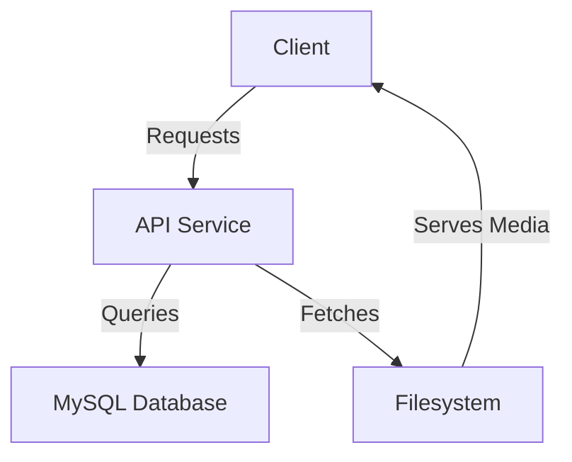

# Media Explorer

## Overview
This project is a self-hosted media explorer designed to run on a Raspberry Pi. It consists of three main services:

- **API**: A backend service built with Go, handling media metadata and database interactions.
- **MySQL**: A database storing media metadata.
- **Filesystem (Nginx)**: A simple file server exposing media files via HTTP.

## Architecture


## Project Structure
```
.
├── README.md           # Project documentation
├── api                # Backend service (Go)
│   ├── Dockerfile     # API Docker configuration
│   ├── go.mod         # Go module file
│   ├── go.sum         # Go dependencies
│   └── main.go        # API entry point
├── app                # Frontend (Next.js)
├── compose.yml        # Docker Compose configuration
├── media-data         # Storage for media files
```

## Setup & Deployment

### Prerequisites
- Docker & Docker Compose installed on your Raspberry Pi.

### Steps
1. Clone this repository:
   
2. Start the services:
   ```sh
   docker compose up -d
   ```
3. Access the API at `http://localhost:8080`.
4. Access media files at `http://localhost/media`.

## Environment Variables
The API service requires the following environment variables:

| Variable        | Description           |
|----------------|-----------------------|
| MYSQL_HOST     | MySQL server hostname |
| MYSQL_PORT     | MySQL port (default 3306) |
| MYSQL_USER     | Database username |
| MYSQL_PASSWORD | Database password |
| MYSQL_DATABASE | Database name |
| FS_BASE_URL    | Base URL for media files |

## License
This project is licensed under the MIT License.

